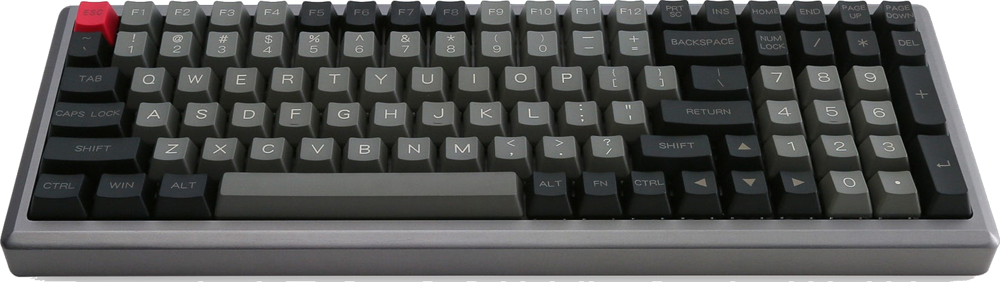

# layouts-melody96

From [QMK](https://github.com/qmk/qmk_firmware/tree/master/keyboards/melody96)
> 96-key Keyboard from YMDK. The PCB for this board is also commonly used in the NYM96.

## Related Links

* [QMK Configurator](https://config.qmk.fm/#/melody96/LAYOUT)
* [qmk_firmware/keyboards/melody96](https://github.com/qmk/qmk_firmware/tree/master/keyboards/melody96)
* [NYM96 Aluminum Mechanical Keyboard | Drop (formerly Massdrop)](https://drop.com/buy/nym96-aluminum-mechanical-keyboard?mode=guest_open)

----

